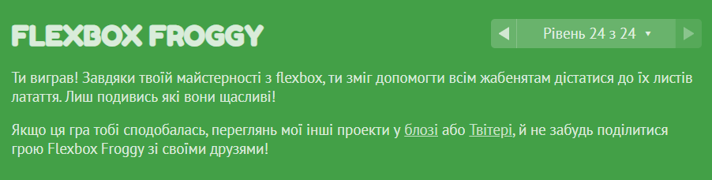

# Sonia's kottans-frontend repository
>**ABOUT ME** :woman::computer: 
>
>Hi everyone! My name is Sonia and I'm really passionate about programming and learning new stuff. Thank you for checking out my repository. I hope you like it ^_^. Thank you!!! <3
>
**README.md content:**
1. [Git Basics](#git-basics)
2. [Linux CLI and Networking](#linux-cli-and-networking)
3. [Git Collaboration](#git-collaboration)
4. [Intro to HTML and CSS](#intro-to-html-and-css)
5. [Responsive Web Design](#responsive-web-design)
---
## Git Basics
While doing this section, I've passed Udacity course about Git. I have already knew basic Git commands, however, some of the commands at the end of the course where new for me.

  
Udacity Course Result :camera:

      

I have also practiced with Git commands on [learngitbranching.js.org](https://learngitbranching.js.org/). The first part of training wasn't hard because it was pretty familiar for me, but working with remote repositories was new and a bit challenging.

  
LearnGit Result :camera:

  

I've also created my local repository kottans-frontend and added README.md file. Making new repository wasn't hard for me, because I've done this several times before. But I've practiced more with formating README.md files.

The most challenging part was working with Kottans/mock-repo repository, because I've never been working with remote repositories, which require Pull requests etc. However, I've completed this task, and it was a completely new and useful experience for me. =)

## Linux CLI and Networking
I had little experience with Linux as well as with Linux Command Line, so course, where I could practise Linux commands was very useful for me. I was only completely familiar with commands from Module 1, but everything else was completely new. Screenshot with my course success is below or it can also be found inside *task_linux_cli* folder.

  
Linux Course Result :camera:

  

I was already familiar with HTTP basics and even had some practise in creating Java RESTful-web-services, but those articles have expanded my understanding of how HTTP actually works and from which parts it consists.

## Git Collaboration

I've accomplished both Qwiklabs Assignments, and this gave me deeper understanding of working with remote repositories and I will definitely use new knowledge in practise.\
**Week 3 Assignment:** [Introduction to Github](https://github.com/SofiiaTrokhymchuk/Intro-to-Github)\
**Week 4 Assignment:** [Pushing Local Commits to Github](https://github.com/SofiiaTrokhymchuk/it-cert-automation-practice)

  
Coursera Results :camera:

  
  

I've also decided to finish all the tasks on [learngitbranching.js.org](https://learngitbranching.js.org/) and I've discovered  new Git commands for myself (for instance, *git cherry-pick*) and I'm pretty sure I 'll use them while working with Git as well, because they make life much easier.

  
Final LearnGit Results :camera:

  
  

I've also checked some additional resources on YouTube so I may assume that now I'm much more confident in using Git.

## Intro to HTML and CSS
Course on Coursera was pretty dull at the beginning but much more interesting at the and because I haven't used Bootstrap before. Even though I've already been familiar with the material, the presentation of information was fast and I liked it.

  
Coursera Results :camera:

  
  

 

Codecademy wasn't interesting enough as well. I think if I was new to HTML and CSS I would definitely 100% like it. But extra practice is always useful.

  
Codecademy Result :camera:

  

 

Overall, passing through this module was kind of tedious because I was already familiar with HTML and CSS so, practically, I haven't learned anything new. *But!!!* I've actually pointed out some nuances which I didn't know that well. So, basically, it wasn't that mush useless.

## Responsive Web Design
This module was extremely interesting for me. First of all,  I'm curious about responsive web-design and different structure types of layouts (*Flexbox and Grid Layout*). Second of all, I like frogs :frog::green_heart:, and I had the oportunity to play with them on [Flexbox Froggy](http://flexboxfroggy.com/#uk).

The first article of this module was interesting, however, I've been already familiar, for instance, with *@media query* and other things, which were mentioned there.

Even though I've already knew a little bit about **Flexbox**, it was super interesting for me to learn new properties and play with code on [Flexbox Froggy](http://flexboxfroggy.com/#uk) and by my own.

  
Flexbox Froggy Result :camera:

  

 

Learning about **Grid** was a bit complicated, because I haven't heard about this layout type before, and Grid is 2-dimentional. Despite this fact, it was still interesting and easy to learn. I think that Grid is the best way to make interesting layouts with images of different sizes (something like collages). And I also had a lot of while olaying with Grid on [Grid Garden](http://cssgridgarden.com/).

  
Grid Garden Result :camera:

  

To sum up, I've learned a lot of new stuff, which I'll definitely use in the future.